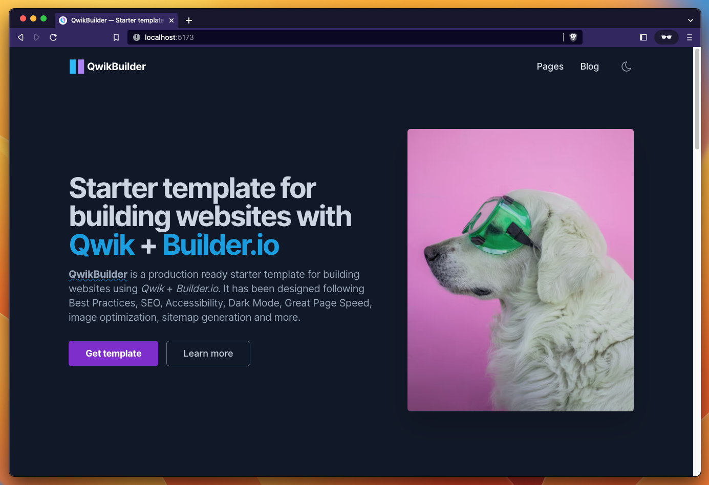

# 💠 QwikBuilder

**QwikBuilder** is an open-source starter template for building websites using **[Qwik](https://qwik.builder.io/) + [Builder.io](https://builder.io/)**

## Features

- ✅ Integration with **Tailwind CSS** supporting **Dark mode**.
- ✅ **Production-ready** scores in [Lighthouse](https://web.dev/measure/) and [PageSpeed Insights](https://pagespeed.web.dev/) reports.
- ✅ **Image optimization** and **Font optimization**.

<br>



[](https://callit.today)
[](https://github.com/callit-today/qwik-builder/blob/main/LICENSE.md)
[](https://github.com/callit-today)
[](https://github.com/callit-today/qwik-builder#contributing)
[](https://snyk.io/test/github/callit-today/qwik-builder)

<br>

<details open>
<summary>Table of Contents</summary>

- [Demo](#demo)
- [Getting started](#getting-started)
  - [Project structure](#project-structure)
  - [Commands](#commands)
  - [Configuration](#configuration)
  - [Deploy](#deploy)
- [Roadmap](#roadmap)
- [Contributing](#contributing)
- [Acknowledgements](#acknowledgements)
- [License](#license)

</details>

<br>

## Demo

📌 [https://qwikbuilder.CALLiT.today/](https://qwikbuilder.callit.today/)

<br>

## Getting started

This project is using Qwik with [QwikCity](https://qwik.builder.io/qwikcity/overview/). QwikCity is just a extra set of tools on top of Qwik to make it easier to build a full site, including directory-based routing, layouts, and more. Rename `.env.example` to `.env` and add your Builder.io public key.

### Project structure

Inside **QwikBuilder** template, you'll see the following folders and files:

```
/
├── adaptors/
|   └── static/
|       └── vite.config.ts
├── public/
│   ├── favicon.svg
│   ├── manifest.json
│   └── robots.txt
├── src/
│   ├── assets/
│   │   ├── images/
|   |   └── styles/
|   |       └── global.css
│   ├── components/
│   │   ├── atoms/
│   │   ├── core/
│   │   ├── icons/
|   |   └── widgets/
|   |       ├── Header.tsx
|   |       ├── Footer.tsx
|   |       └── ...
│   ├── content/
│   |   ├── blog/
│   |   |   ├── post-slug-1.md
│   |   |   ├── post-slug-2.md
│   |   |   └── ...
│   ├── routes/
│   |   ├── blog/
│   |   ├── index.tsx
|   |   ├── layout.tsx
|   |   └-- service-worker.ts
│   ├── config.mjs
│   ├── entry.dev.tsx
│   ├── entry.preview.tsx
│   ├── entry.ssr.tsx
│   └── root.tsx
├── package.json
├── .env.example
└── ...
```

- `src/routes`: Provides the directory based routing, which can include a hierarchy of `layout.tsx` layout files, and an `index.tsx` file as the page. Additionally, `index.ts` files are endpoints. Please see the [routing docs](https://qwik.builder.io/qwikcity/routing/overview/) for more info.

- `src/components`: Recommended directory for components.

- `public`: Any static assets, like images, can be placed in the public directory. Please see the [Vite public directory](https://vitejs.dev/guide/assets.html#the-public-directory) for more info.

[](https://githubbox.com/callit-today/qwik-builder/tree/main)

> **Seasoned Qwik expert?** Delete this file. Update `config.mjs` and contents. Have fun))

<br>

### Commands

All commands are run from the root of the project, from a terminal:

| Command            | Action                                         |
| :----------------- | :--------------------------------------------- |
| `npm install`      | Installs dependencies                          |
| `npm run dev`      | Starts local dev server at `127.0.0.1:5173/`   |
| `npm run build`    | Build your production site to `./dist/`        |
| `npm run preview`  | Preview your build locally, before deploying   |
| `npm run fmt`      | Format codes with Prettier                     |
| `npm run lint`     | Run Eslint                                     |
| `npm run qwik ...` | Run CLI commands like `qwik add`, `qwik build` |

<br>

### Configuration

Basic configuration file: `./src/config.mjs`

```javascript
export const SITE = {
  name: 'Example',

  origin: 'https://example.com',
  basePathname: '/', // Change this if you need to deploy to Github Pages, for example
  trailingSlash: true, // Generate permalinks with or without "/" at the end
};
```

<br>

### Deploy

#### Deploy to production (manual)

You can create an optimized production build with:

```shell
npm run build
```

Now, your website is ready to be deployed. All generated files are located at
`dist` folder, which you can deploy the folder to any hosting service you
prefer.

#### Deploy to Netlify

Clone this repository on own GitHub account and deploy to Netlify:

[](https://app.netlify.com/start/deploy?repository=https://github.com/callit-today/qwik-builder)

#### Deploy to Vercel

Clone this repository on own GitHub account and deploy to Vercel:

[](https://vercel.com/new/clone?repository-url=https%3A%2F%2Fgithub.com%2Fcallit-today%2Fqwik-builder)

<br>

## Roadmap

### Base

- [ ] Create utilities to generate permalinks tailored to the domain and base pathname.
- [ ] Simplify the way to optimize images.
- [ ] Create component to make SEO simpler and more intuitive.
- [ ] Create configurable blog with categories, tags and authors using MDX.
- [ ] Add more frequently used pages (Portfolio, Services, Contact, Docs ...).
- [ ] Find or create a library to have more icon sources available.
- [ ] Refactor some code that doesn't follow Qwik conventions yet.

### Advanced

- [ ] Achieve perfect 100% Google Page Speed score.
- [ ] Insert complex javascript example widget on home page to demonstrate Qwik features.
- [ ] Create small illustrative admin backend.

<br>

## Contributing

If you have any idea, suggestions or find any bugs, feel free to open a discussion, an issue or create a pull request.
That would be very useful for all of us and we would be happy to listen and take action.

## Acknowledgements

Initial project by [onWidget](https://github.com/onwidget/qwind). This [CALLiT.today](https://callit.today) build extends the static app with Builder.io integration.

## License

**QwikBuilder** is licensed under the MIT license — see the [LICENSE](https://github.com/callit-today/qwik-builder/blob/main/LICENSE.md) file for details.
